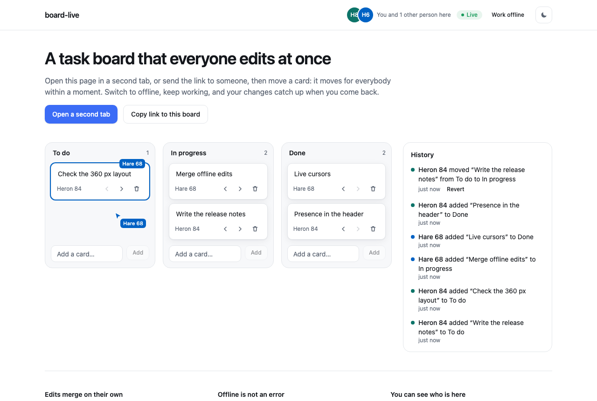
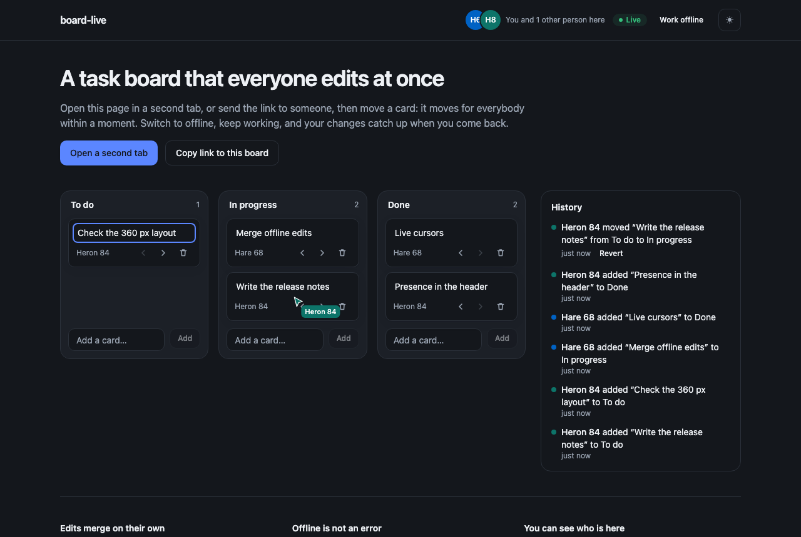

# board-live

A task board that everyone edits at once. Open it in two tabs, or send the link to someone: move a card and it moves for everybody within a moment. Switch one side offline, keep working in both, and every change catches up when it comes back — nothing overwrites anything.

**[Try it live](https://mrnednick.github.io/board-live/)** — open the board in a second tab and move a card. The live demo has no sync server, so it syncs the tabs of one browser (presence, cursors and offline merge included). Between devices the same board needs the small relay in [`server/`](server/server.mjs) running somewhere — see [Deploy](#deploy).



<details>
<summary>The same board from the other person's side, in the dark theme</summary>



</details>

## What it does

- **Cards and columns.** Add, rename, drag between columns or move with the arrow buttons, delete. Column names are editable too.
- **Live for everyone.** A card added in one browser shows up in the other in a few milliseconds on a local relay; a move takes about ten.
- **Presence.** Faces in the header, a named cursor for everyone else over the board, and a coloured outline with a name on any card someone is dragging or typing into. Close a tab and its face and cursor are gone at once.
- **Offline without an error screen.** The board is also stored in the browser. "Work offline" cuts every connection; edits keep landing locally and travel as soon as you go back online. Two people who typed into the same card while apart both keep their words.
- **History.** Who added, renamed, moved or deleted what, and when. Renames, moves and deletions can be reverted, and the revert is itself a line everyone sees.
- **Empty, loading and error states**, a 360 px layout, both themes, and every action is reachable from the keyboard.

## Why Yjs, and what that bought

There is no server-side referee. Every change is a [Yjs](https://docs.yjs.dev/) update — a CRDT — and updates merge to the same result in any order, from any number of places. That one property is what makes the rest simple:

| Path | What carries the updates |
|---|---|
| This browser, across restarts | IndexedDB (`y-indexeddb`) — the board opens before any network is involved |
| Tabs of the same browser | a `BroadcastChannel`, with a two-message handshake of state vectors — no server needed at all |
| Everyone else | a WebSocket to the relay in [`server/`](server/server.mjs), about a hundred lines on `ws` and `y-protocols` |

None of the three knows about the others, and going offline is just closing the last two. The relay keeps rooms in memory and has no opinion about the data; it relays sync and awareness messages and holds the latest state for whoever joins next.

A few decisions that are easy to get wrong:

- **Card titles are `Y.Text`, edited by diff.** Typing computes the smallest insert and delete between the old and new value instead of replacing the string, so concurrent typing merges character by character. The title input is uncontrolled and patched by hand on remote edits, so the caret does not jump while someone else types in the same card.
- **Default columns have fixed ids.** Two people opening an empty board at the same moment both create "To do", "In progress" and "Done" — under the same keys, so the merge yields three columns, not six.
- **Order is a fractional number.** Dropping a card between two others takes the midpoint, so a move never renumbers anyone else's cards and cannot collide with a concurrent move.
- **Deletions do not move a state vector.** The UI re-renders on an update counter, not on the vector, or a deleted card would linger on screen.

Code map: `src/board/model.ts` — the board as pure functions over a `Y.Doc`; `src/board/connection.ts` — IndexedDB, the tab channel, the WebSocket and presence; `src/board/use-board.ts` — React hooks on `useSyncExternalStore`; `src/components/board/` — the interface. Buttons, inputs, badges, avatars, the empty state and skeletons come from a shared component registry.

## Run it

Node 22 or later.

```bash
npm install
npm run dev                  # tabs of this browser sync with each other
npm run server               # relay on ws://localhost:1234 (PORT to change)
VITE_BOARD_SERVER=ws://localhost:1234 npm run dev   # now other browsers join too
```

Boards are rooms: `?board=planning` opens a different one. Your name and colour are picked for you and kept in this browser.

```bash
npm test          # two tabs, offline merge, history, board actions (Vitest + Testing Library)
npm run lint      # oxlint
npm run build
```

The tests open two connections to one room the way two tabs do, take one offline, edit the same card on both sides and check that both edits survive; breaking the text diff fails them.

## Deploy

GitHub Pages hosts the static board (CI builds it on every push to `main`): that is the live demo, with sync between the tabs of one browser. The relay is a small Node process that needs a host that keeps WebSockets open. [`render.yaml`](render.yaml) describes both: on Render, **New → Blueprint** and pick this repository — the static site is built with the relay's address filled in. Without a relay the site still works, with sync between the tabs of one browser.

Lighthouse on the production build: 100 accessibility, 100 best practices, 100 SEO, 89 performance.
